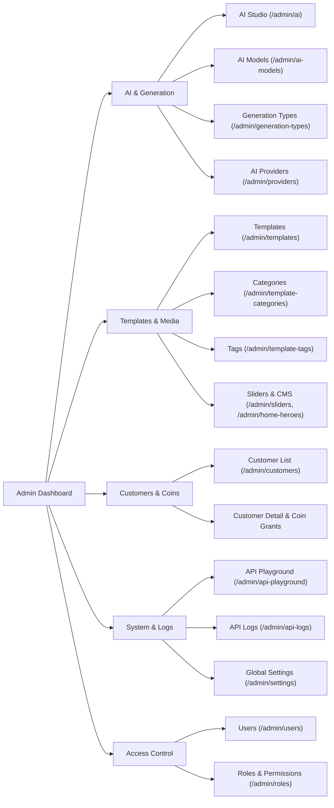

# HTUT AI — Admin Dashboard Documentation

Comprehensive guide to the Admin Dashboard for **HTUT AI**: architecture, role-based access control (RBAC), features, routing, and workflows.

---

## 1. Overview & Tech Stack

The HTUT AI Admin Dashboard is a unified management console built on modern Laravel + Inertia.js architecture:

- **Backend Framework**: Laravel 13 (PHP 8.4)
- **Frontend Architecture**: Inertia v3 + React 19 + TypeScript
- **UI & Styling**: Tailwind CSS v4, shadcn/ui primitives, Framer Motion animated components (`AnimatedButton`, `AnimatedCard`)
- **Authentication**: Laravel Fortify (Session cookies, Passkeys / WebAuthn, 2FA support)
- **Stateful API Security**: `EnsureFrontendRequestsAreStateful` middleware (sharing the same underlying API endpoints between admin and mobile)
- **Object Storage**: DigitalOcean Spaces (`spaces` disk) with automatic UUID file naming
- **API Documentation**: Scramble OpenAPI (`/docs/api`)

---

## 2. Role-Based Access Control (RBAC)

The system enforces strict permission checks via Laravel middleware (`middleware('permission:xxx')`).

### Roles (6 Roles)
1. **`super-admin`**: Full system access, ignores individual permission checks.
2. **`admin`**: Full administrative operations across templates, customers, providers, and settings.
3. **`manager`**: Management of content, templates, customers, and models.
4. **`editor`**: Template and showcase content creation and editing.
5. **`support`**: Customer lookup, account status (ban/unban), and manual coin adjustments.
6. **`user`**: Basic authenticated access.

### Permissions Matrix (15 Permissions)
| Permission | Description | Assigned Roles |
|---|---|---|
| `users.view` | View admin user list | `super-admin`, `admin` |
| `users.manage` | Create, edit, delete admin users | `super-admin`, `admin` |
| `roles.view` | View roles and permissions | `super-admin`, `admin` |
| `roles.manage` | Create and assign roles | `super-admin` |
| `providers.view` | View AI provider statuses | `super-admin`, `admin` |
| `providers.manage` | Toggle provider active status | `super-admin`, `admin` |
| `ai.view` | Access internal AI studio & generator | `super-admin`, `admin`, `manager` |
| `api.playground` | Access interactive API Playground | `super-admin`, `admin` |
| `templates.view` | View templates, categories, tags, sliders | `super-admin`, `admin`, `manager`, `editor` |
| `templates.manage` | Create/edit/delete templates & AI models | `super-admin`, `admin`, `manager`, `editor` |
| `customers.view` | View customer directory & generation stats | `super-admin`, `admin`, `manager`, `support` |
| `customers.manage` | Ban/unban customers, grant coins | `super-admin`, `admin`, `support` |
| `settings.manage` | Manage coin costs, API logs, CMS sections | `super-admin`, `admin` |

---

## 3. Admin Routes & Navigation Map

All admin routes live under the `/admin` prefix and require `['auth', 'verified']`.



### Route Summary Table

| URL | Method | Name | Permission | Purpose |
|---|---|---|---|---|
| `/dashboard` | `GET` | `dashboard` | Authenticated | Dashboard KPI statistics and recent activity |
| `/admin/ai` | `GET` | `admin.ai.index` | `ai.view` | Internal multi-model generation studio |
| `/admin/ai-models` | `GET` | `admin.ai-models.index` | `templates.view` | Dynamic AI models & pricing list |
| `/admin/ai-models/create` | `GET`/`POST` | `admin.ai-models.create` | `templates.manage` | Register new model with resolution/duration tiers |
| `/admin/ai-models/{id}/edit`| `GET`/`PUT` | `admin.ai-models.edit` | `templates.manage` | Edit model pricing tiers & status |
| `/admin/generation-types` | `GET`/`POST` | `admin.generation-types.index` | `settings.manage` | Generation category classifications |
| `/admin/templates` | `GET` | `admin.templates.index` | `templates.view` | Template gallery & cost overview |
| `/admin/templates/create` | `GET`/`POST` | `admin.templates.create` | `templates.manage` | Upload template with discount pricing & AI model |
| `/admin/templates/{id}/edit`| `GET`/`PUT` | `admin.templates.edit` | `templates.manage` | Update template media, prompt, discount coins |
| `/admin/templates/from-generation/{id}` | `POST` | `admin.templates.from-generation` | `templates.manage` | Quick-save generation to template |
| `/admin/template-categories` | `CRUD` | `admin.template-categories.*` | `templates.view/manage` | Category hierarchy |
| `/admin/template-tags` | `CRUD` | `admin.template-tags.*` | `templates.view/manage` | Discovery tags |
| `/admin/customers` | `GET` | `admin.customers.index` | `customers.view` | Customer list with balances and status |
| `/admin/customers/{id}` | `GET` | `admin.customers.show` | `customers.view` | Customer detail, spending stats, history |
| `/admin/customers/{id}/add-coins` | `POST` | `admin.customers.add-coins` | `customers.manage` | Manual coin credit |
| `/admin/customers/{id}/ban` | `PATCH` | `admin.customers.ban` | `customers.manage` | Suspend customer access |
| `/admin/customers/{id}/unban` | `PATCH` | `admin.customers.unban` | `customers.manage` | Re-activate customer access |
| `/admin/providers` | `GET` | `admin.providers.index` | `providers.view` | Segmind provider config and toggle |
| `/admin/api-playground` | `GET` | `admin.api-playground.index` | `api.playground` | Interactive tester for all 16 routes |
| `/admin/api-logs` | `GET` | `admin.api-logs.index` | `settings.manage` | Real-time HTTP request & latency logs |
| `/admin/settings` | `GET`/`PUT` | `admin.settings.index` | `settings.manage` | Coin cost fallbacks & global configs |
| `/admin/sliders` | `CRUD` | `admin.sliders.*` | `templates.view/manage` | Mobile & web promotional carousel sliders |
| `/admin/home-heroes` | `CRUD` | `admin.home-heroes.*` | `settings.manage` | Homepage hero banners |
| `/admin/home-showcases` | `CRUD` | `admin.home-showcases.*` | `settings.manage` | Homepage generation showcase grids |
| `/admin/home-features` | `CRUD` | `admin.home-features.*` | `settings.manage` | Feature highlights |
| `/admin/partners` | `CRUD` | `admin.partners.*` | `settings.manage` | Brand partner logos |

---

## 4. Key Modules & Functional Deep Dives

### 4.1. Dynamic AI Models & Pricing Engine
Located at `/admin/ai-models`. Models are stored in `ai_models` and linked to `generation_types`.

- **Base Coin Cost**: Standard coin deduction when using this model.
- **Resolution Pricing Tiers**: JSON mapping of resolution keys to coin costs.
  * *Example*: `{"480p": 10, "720p": 20}` or `{"1K": 8, "2K": 12, "3K": 16}`.
- **Duration Pricing Tiers**: JSON mapping of video lengths to coin costs.
  * *Example*: `{"5s": 10, "10s": 20}`.
- **Active & Default**: Allows setting default models per generation type and switching models on/off without code deployments.
- **Live API Export**: The API endpoint `GET /api/v1/coin-costs` reads directly from active models in the database so the mobile app and customer web frontend automatically reflect admin adjustments.

### 4.2. Templates & Discount Pricing System
Located at `/admin/templates`. Templates serve as pre-made assets for Face Swap, Video Face Swap, and generative styles.

- **AI Model Link**: Each template is assigned an `ai_model_id`. Selecting an AI model in the form automatically auto-populates the template's base `cost`.
- **Discount Coin Cost**:
  - `cost`: Base coin price (e.g. `20`).
  - `discount_cost`: Subtracted discount (e.g. `5`, default `0`).
  - `effective_cost`: Computed as `max(0, cost - discount_cost)` (e.g. `15` coins).
- **Customer Deduction**: When a customer generates media using a template, the API charges `template.effective_cost`.
- **Live Preview UI**:
  - **Create & Edit Pages**: Card-based form with real-time price preview banner, `% OFF` badge, and immediate media players for images and videos.
  - **Template Gallery Table**: Strikethrough pricing (`~20~ 15 coins`) with status badges.
- **"Save to Template" Workflow**: Any completed generation in `/admin/ai` can be saved directly as a template with 1-click. Media files are cloned inside DigitalOcean Spaces to `templates/{uuid}.ext`.

### 4.3. Customer Management & Coin Economy
Located at `/admin/customers`.
- Every registered customer starts with **100 welcome coins** (configurable).
- **Customer Overview**: Lists registration date, email, verified status, coin balance, and active/banned status.
- **Customer Detail**:
  - Displays total USD API cost incurred (from provider metrics) alongside total coins spent.
  - Generates generational activity history and recent logs.
- **Action Modal**: Admins can immediately grant bonus coins or ban abusive accounts.

### 4.4. AI Studio
Located at `/admin/ai`.
- Internal testing workbench for administrators.
- Supports all generation types:
  - **Face Swap**: Source face + Target image upload/URL.
  - **Video Face Swap**: Source face + Target video file/URL (queued background processing).
  - **Text to Image**: Prompt, negative prompt, aspect ratio, seed, and model selection.
  - **Image Editing**: Multi-image reference (Kontext Max), Flux Kontext Dev, Seedream V5, GPT Image 1.5, Kling 3, Nano Banana Pro.
  - **Image to Video**: Wan 2.2 Flash with 480p/720p resolution toggles.
- **Output Storage**: Every generation output is downloaded from Segmind and stored to our DigitalOcean Spaces bucket. Segmind raw URLs are never exposed.

### 4.5. API Playground
Located at `/admin/api-playground`.
- In-browser interactive API client for all 16 routes.
- Handles automatic Sanctum Bearer token injection and CSRF cookies.
- Toggle between `multipart/form-data` file uploads and `application/json` payloads.
- Displays request duration, response status code, and syntax-highlighted JSON body.

### 4.6. API Request Logs
Located at `/admin/api-logs`.
- Records every incoming request to `/api/v1/*`.
- Captures: HTTP Method, Endpoint path, Status code, Duration (ms), IP address, User Agent, Requester type & ID, and Payload.
- Full payload inspection drawer for debugging customer issues.

---

## 5. Storage & Cloud Media Architecture

- All files (templates, customer face uploads, AI generation outputs) live on **DigitalOcean Spaces**:
  - Region: `sgp1`
  - Bucket: `imagesbucket`
  - Base URL: `https://imagesbucket.sgp1.digitaloceanspaces.com`
- Storage paths:
  - `templates/{uuid}.{ext}`: Master template image/video files.
  - `templates/thumbnails/{uuid}.{ext}`: Compressed preview thumbnails.
  - `faces/{uuid}.{ext}`: Customer face swap source inputs.
  - `generations/{uuid}.{ext}`: Stored outputs from Segmind.
- Database records store relative paths (`templates/abc.jpg` or `generations/xyz.mp4`). Accessors like `file_url` generate the full CDN URL via `Storage::disk('spaces')->url(...)`.

---

## 6. Maintenance Commands

Run these Artisan commands from the backend directory:

```bash
# Style fix (PHP Pint)
vendor/bin/pint --dirty --format agent

# Re-seed AI models and pricing tiers
php artisan db:seed --class=AIModelSeeder

# Clean up generations stuck in processing (> 10 mins)
php artisan app:cleanup-stuck-generations

# Fix any legacy Segmind URLs stored in DB
php artisan fix:segmind-urls

# Run tests
php artisan test --compact --filter=TemplateCrudTest
```

---

## 7. Frontend Build & Dev

```bash
# Build Admin Dashboard (Inertia + React + Vite)
npm run build

# Type check
npm run types:check

# Dev mode (concurrent Laravel + Vite)
composer run dev
```
