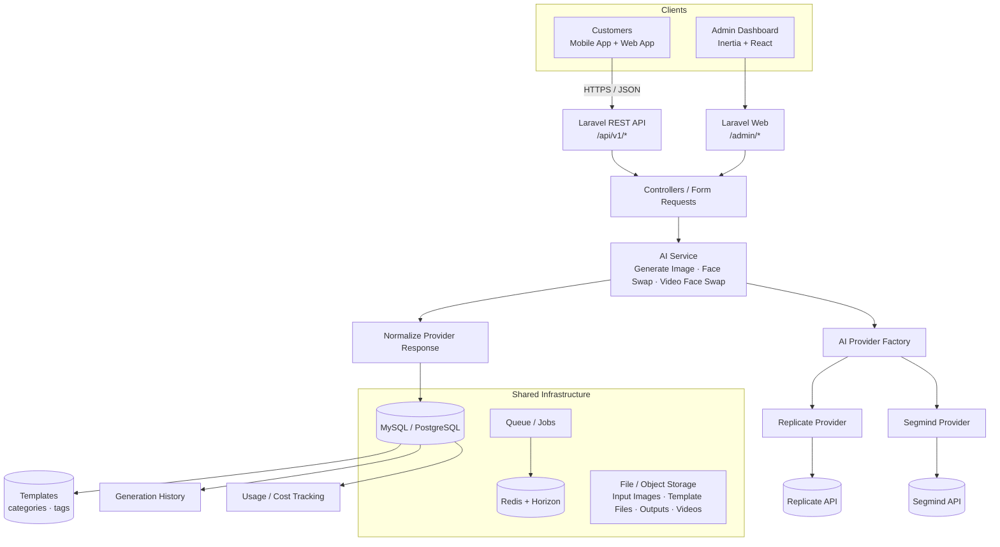
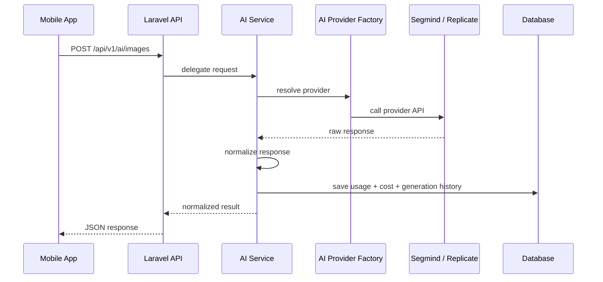
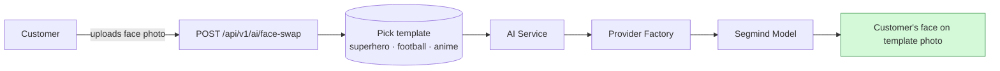
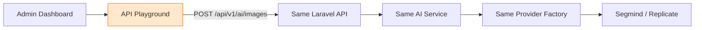
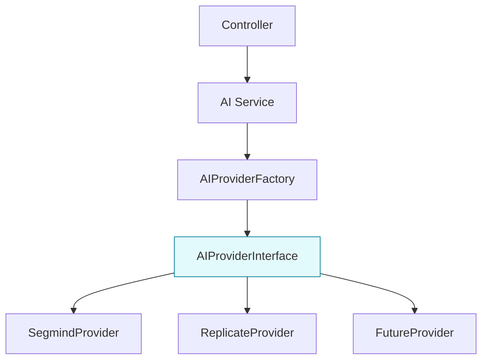
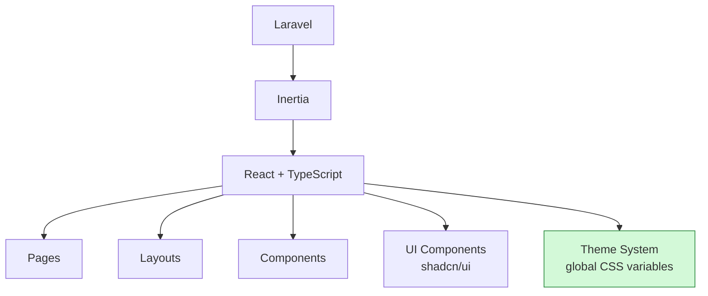
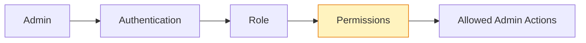
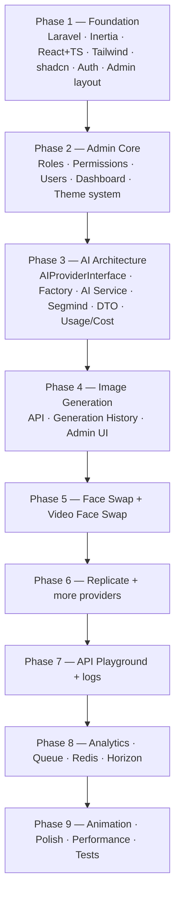

# AI Platform — High-Level Architecture

## 1. System overview



## 2. Main flow — Mobile App



## 3. Face swap flow — customer + template



The customer picks a template (Superman, football player, anime character, ...) and uploads their own face. The output is their face on that template. Templates support **image and video** files and are looked up by **slug**, never by id.

## 4. Admin API Playground — same endpoints, no duplicate logic



**Rule:** the Admin Playground is a Postman-like client for the mobile API. It calls the exact same endpoints — never write separate AI-generation logic for it.

## 5. AI Provider architecture



- Controllers must **never** call Segmind/Replicate directly.
- Every provider implements the common `AIProviderInterface`.
- Provider responses are normalized into one internal format (`AIResponse` DTO).
- Adding a new provider must not require rewriting business logic.

## 6. Admin dashboard modules

```mermaid
flowchart LR
    ADMIN[/admin/]
    ADMIN --> DASH[dashboard]
    ADMIN --> AI[ai]
    AI --> IMG[image-generation]
    AI --> FS[face-swap]
    AI --> VFS[video-face-swap]
    AI --> GEN[generations]
    ADMIN --> TEMPLATES[templates]
    TEMPLATES --> T_CAT[categories CRUD]
    TEMPLATES --> T_LIST[template CRUD]
    TEMPLATES --> T_TAGS[tags CRUD]
    ADMIN --> PROV[providers]
    PROV --> PSEG[segmind]
    PROV --> PREP[replicate]
    PROV --> PUSE[usage]
    ADMIN --> PLAY[api-playground]
    ADMIN --> USERS[users - admins]
    ADMIN --> CUST[customers]<br/>free / premium
    ADMIN --> ROLES[roles]
    ADMIN --> PERMS[permissions]
    ADMIN --> ANAL[analytics]
    ANAL --> AUSE[usage]
    ANAL --> ACST[costs]
    ADMIN --> SET[settings]
    SET --> THEME[theme]
```

## 7. Frontend structure



**Theme rule:** global CSS variables control every design token.

```css
:root {
    --primary: ...;
    --primary-foreground: ...;
    --background: ...;
    --foreground: ...;
    --card: ...;
    --border: ...;
}
```

## 8. Authentication & authorization



Example permissions:

| Permission | Meaning |
|---|---|
| `dashboard.view` | View dashboard |
| `ai.generate` | Run AI generations |
| `ai.view` | View generation history |
| `providers.view` / `providers.manage` | View / manage providers |
| `api.playground` | Use the API playground |
| `users.view` / `users.manage` | View / manage users |
| `roles.view` / `roles.manage` | View / manage roles |
| `settings.manage` | Manage settings |

## 9. Development order



## 10. Important architecture rules

1. Admin Playground and Mobile App **must** use the same API endpoints.
2. Controllers must not directly call Segmind or Replicate.
3. All providers implement a common provider contract.
4. Provider-specific responses are normalized into an internal response format.
5. Provider usage and cost are persisted.
6. Provider API keys are **never** exposed to React or the Mobile App.
7. Authorization is enforced on the Laravel backend (React only knows permissions for UI show/hide).
8. Theme colors are controlled through global CSS variables.
9. Long-running AI operations use queues/jobs where appropriate.
10. Adding a new AI provider must not rewrite existing business logic.
11. Customers (mobile + web end users) and admins (dashboard) share the same AI services and providers — never two implementations.
12. Templates are looked up by **slug** (indexed), never by id; free customers get a limited generation quota enforced in the API.
