# AI Platform — Database Diagram

## Entity relationship diagram

```mermaid
erDiagram
    USERS ||--o{ PASSKEYS : "has"
    USERS ||--o{ ROLE_USER : "has role"
    ROLES ||--o{ ROLE_USER : "assigned to"
    ROLES ||--o{ PERMISSION_ROLE : "grants"
    PERMISSIONS ||--o{ PERMISSION_ROLE : "granted to"

    CUSTOMERS ||--o{ AI_GENERATIONS : "makes"
    USERS ||--o{ AI_GENERATIONS : "makes"
    AI_PROVIDERS ||--o{ AI_GENERATIONS : "served by"
    TEMPLATES ||--o{ AI_GENERATIONS : "used in (face swap)"
    TEMPLATE_CATEGORIES ||--o{ TEMPLATES : "contains"
    TEMPLATES ||--o{ TEMPLATE_TAG : "tagged"
    TEMPLATE_TAGS ||--o{ TEMPLATE_TAG : "used in"
    CUSTOMERS ||--o{ API_REQUEST_LOGS : "makes"
    USERS ||--o{ API_REQUEST_LOGS : "makes"
    CUSTOMERS ||--o{ CUSTOMER_SUBSCRIPTIONS : "subscribes to"

    USERS {
        bigint id PK
        string name
        string email UK
        timestamp email_verified_at
        string password
        text two_factor_secret
        text two_factor_recovery_codes
        timestamp two_factor_confirmed_at
        string remember_token
        timestamp created_at
        timestamp updated_at
    }

    PASSKEYS {
        bigint id PK
        bigint user_id FK
        string name
        string credential_id
        text public_key
        json transports
        timestamp created_at
        timestamp updated_at
    }

    CUSTOMERS {
        bigint id PK
        string name
        string email UK
        string password "nullable (social login)"
        string avatar "nullable"
        string auth_provider "google, apple (tiktok, facebook in v2)"
        string auth_provider_id "provider user id"
        string customer_type "free, premium"
        unsignedInt coins "default 100 - free customers start with 100 coins"
        timestamp email_verified_at
        timestamp last_active_at
        timestamp created_at
        timestamp updated_at
    }

    CUSTOMER_SUBSCRIPTIONS {
        bigint id PK
        bigint customer_id FK
        string plan "free, premium"
        string provider "stripe, revenuecat, kbz, google_pay, apple_pay"
        string status "active, cancelled, expired"
        timestamp starts_at
        timestamp ends_at
        timestamp created_at
        timestamp updated_at
    }

    ROLES {
        bigint id PK
        string name
        string slug UK
        text description
        timestamp created_at
        timestamp updated_at
    }

    PERMISSIONS {
        bigint id PK
        string name
        string slug UK
        text description
        timestamp created_at
        timestamp updated_at
    }

    ROLE_USER {
        bigint role_id FK
        bigint user_id FK
    }

    PERMISSION_ROLE {
        bigint permission_id FK
        bigint role_id FK
    }

    TEMPLATE_CATEGORIES {
        bigint id PK
        string name
        string slug UK
        text description
        boolean is_active
        timestamp created_at
        timestamp updated_at
    }

    TEMPLATES {
        bigint id PK
        bigint category_id FK
        string slug UK "used in API, not id"
        string name
        text description
        string type "image, video"
        string file_path "image or video file"
        string thumbnail_path
        string model "segmind model for this template"
        unsignedInt cost "default 0 - coins charged per generation"
        boolean is_active
        timestamp created_at
        timestamp updated_at
    }

    TEMPLATE_TAGS {
        bigint id PK
        string name
        string slug UK
        timestamp created_at
        timestamp updated_at
    }

    TEMPLATE_TAG {
        bigint template_id FK
        bigint tag_id FK
    }

    AI_PROVIDERS {
        bigint id PK
        string name
        string slug UK
        boolean is_active
        json config
        timestamp created_at
        timestamp updated_at
    }

    AI_GENERATIONS {
        bigint id PK
        bigint user_id FK "nullable - admin made"
        bigint customer_id FK "nullable - customer made"
        bigint provider_id FK "source of truth - no provider string column"
        bigint template_id FK "nullable - face swap template"
        string operation "image, face-swap, video-face-swap"
        string status "queued, processing, completed, failed"
        string request_id
        decimal cost "nullable - null = provider did not report a cost"
        string currency "nullable"
        integer duration_ms
        json input_metadata
        json output_metadata
        json raw_response
        text error "nullable - failure detail"
        timestamp created_at
        timestamp updated_at
    }

    API_REQUEST_LOGS {
        bigint id PK
        bigint user_id FK "nullable - admin"
        bigint customer_id FK "nullable - customer"
        string method
        string path
        json request_headers "sensitive values (Authorization, Cookie) excluded"
        json request_body
        integer response_status
        json response_headers "logged in full - billing/cost info"
        json response_body
        integer duration_ms
        timestamp created_at
        timestamp updated_at
    }
```

## Table reference

### Core auth (already exists)

| Table | Purpose | Notes |
|---|---|---|
| `users` | **Admin** users | Laravel default with two-factor + passkeys. Separate from customers |

### Customers (end users — mobile app + web app)

| Table | Purpose |
|---|---|
| `customers` | **End users** (mobile app + web app) who generate images / face swaps. Separate from admin `users` |
| `customer_subscriptions` | Plan + payment records. **Payment integration (KBZ, RevenueCat, Stripe, Google Pay, Apple Pay) is deferred** — table is designed now, wired later |

`customers` key columns:

- `email` + `password` — email login
- `auth_provider` + `auth_provider_id` — **Google, Apple** now; **TikTok, Facebook in version 2**
- `customer_type` — `free`, `premium`. Free users get limited generation (quota enforced in the Laravel API)
- `coins` — **default 100**. Free customers start with 100 coins; each generation charges the **template's cost** in coins

### Roles & permissions (admin, Phase 2)

| Table | Purpose |
|---|---|
| `roles` | Admin roles: Super Admin, Admin, Developer, AI Manager, Support, Viewer |
| `permissions` | Granular permissions: `dashboard.view`, `ai.generate`, `users.manage`, ... |
| `role_user` | Many-to-many: which user has which role |
| `permission_role` | Many-to-many: which role grants which permission |

Permissions are enforced on the **Laravel backend**. React only receives the permission names for UI show/hide.

### Templates (face swap core)

The customer **uploads their face**, picks a **template** (e.g. a Superman photo), and the app swaps the face onto the template.

| Table | Purpose |
|---|---|
| `template_categories` | Template groups: **Superhero, Football, Anime**, ... (CRUD in admin) |
| `templates` | The actual templates: image **or video** files |
| `template_tags` | Tags for global search (e.g. `superman`, `football`, `anime`, `hd`) |
| `template_tag` | Many-to-many between templates and tags |

`templates` key columns:

- `slug` — **unique and indexed; the API uses the slug, never the id**
- `type` — `image` or `video` (file upload is not only images)
- `file_path` / `thumbnail_path` — stored on object storage
- `model` — which Segmind model this template uses (the project uses many Segmind models)
- `cost` — **default 0**; coins charged per generation using this template (varies by template/provider setup)
- `is_active` — hide templates without deleting them

### AI providers (Phase 3)

| Table | Purpose |
|---|---|
| `ai_providers` | Provider registry (Segmind, Replicate, ...). `config` holds non-secret settings; **API keys live in `.env`, never in the DB** |

### AI generations (Phase 3/4)

| Table | Purpose |
|---|---|
| `ai_generations` | One row per generation. Made by a **customer** (mobile) or an **admin** (dashboard) |

Key columns:

- `user_id` **or** `customer_id` — whoever requested it (one of the two is set)
- `template_id` — set for face swaps: which template was used
- `provider_id` — **the source of truth** for the provider (no duplicated provider string; join to `ai_providers` for the name)
- `operation` — `image`, `face-swap`, `video-face-swap`
- `status` — `queued`, `processing`, `completed`, `failed`
- `request_id` — provider's request ID for tracing
- `cost` + `currency` — normalized cost; **`null` when the provider does not report a real cost (never fake 0)**. Segmind reports `metrics.cost` in v2 responses
- `duration_ms` — how long the call took (provider `metrics.inference_time` preferred)
- `input_metadata` / `output_metadata` / `raw_response` — normalized + original payloads

This table powers the dashboard stat cards (Today's Cost, Total Generations, Face Swaps, Video Generations) and the usage/cost analytics.

### API request logs (Phase 4)

| Table | Purpose |
|---|---|
| `api_request_logs` | Every request made to the shared `/api/*` endpoints (face swap now, API playground later): method, path, request headers (sensitive ones excluded), body, response status, **response headers (full — billing/cost source)**, response body, duration |

## Relationships in plain words

- A **customer** (mobile or web end user) makes **AI generations**, **API requests**, and has **subscriptions**.
- An **admin user** also makes **AI generations** (from the dashboard) and has **roles → permissions**.
- A **template category** contains many **templates**; a **template** has many **tags**.
- An **AI generation** for face swap references the **template** used.
- An **AI provider** serves many **AI generations**.

## Notes for implementation

- Migrations for `users`, `passkeys`, `cache`, `jobs` already exist — do not recreate.
- New tables by phase: roles/permissions (Phase 2), templates/categories/tags (Phase 2), providers/generations (Phase 3), request logs (Phase 7), customers + subscriptions (Phase 1 mobile auth).
- API keys are environment variables (`SEGMIND_API_KEY`, `REPLICATE_API_TOKEN`), never stored in `ai_providers.config`.
- `ai_generations` grows fast: index on `(user_id, created_at)`, `(customer_id, created_at)`, `status`.
- `templates.slug` must be indexed (API lookups by slug).
- Free-user quota: `customers.customer_type` + a counter on `ai_generations` (e.g. generations today per customer) enforced in the Laravel API.
