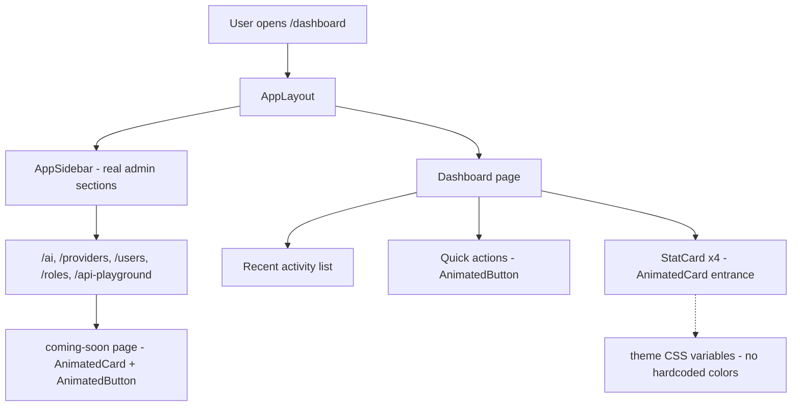

# Admin Dashboard Layout (animated)

## What it does

Rebuilds the admin dashboard shell with the project's own identity and navigation, using the animated shadcn/ui wrappers (`AnimatedButton`, `AnimatedCard`) as the interaction layer. This is Phase 1 (Admin layout) plus the first slice of Phase 2 (Dashboard + Admin navigation) from `project-usecase.md`.

The old starter-kit shell only had a "Dashboard" link and a placeholder dashboard. Now:

- The **sidebar** shows the real admin sections: Dashboard, AI Generation, Providers, Users, Roles & Permissions, API Playground, Settings.
- The **dashboard page** shows themed stat cards (Today's Cost, Total Generations, Face Swaps, Video Generations), a recent activity list, and quick actions.
- Not-yet-built sections route to a shared **"Coming Soon"** page.

## Flowchart



## How it works

### Routes — `routes/web.php`

Five placeholder routes were added, all behind `auth` + `verified` middleware. Each renders the shared `coming-soon` page with the section title as a prop:

```php
Route::inertia('ai', 'coming-soon', ['title' => 'AI Generation'])->name('ai');
Route::inertia('providers', 'coming-soon', ['title' => 'Providers'])->name('providers');
Route::inertia('users', 'coming-soon', ['title' => 'Users'])->name('users');
Route::inertia('roles', 'coming-soon', ['title' => 'Roles & Permissions'])->name('roles');
Route::inertia('api-playground', 'coming-soon', ['title' => 'API Playground'])->name('api-playground');
```

### Sidebar — `resources/js/components/app-sidebar.tsx`

`mainNavItems` now lists every admin section with a lucide icon. Active state is handled by the existing `NavMain` component (`useCurrentUrl`). Settings points at the real settings page (`/settings/profile`).

### Dashboard — `resources/js/pages/dashboard.tsx`

- **Header** — title, subtitle, and a "New Generation" `AnimatedButton` linking to `/ai`.
- **Stat cards** — a new reusable `StatCard` component (`resources/js/components/admin/stat-card.tsx`) that wraps `AnimatedCard` + `CardContent`. Each card gets an icon in a themed tinted square (emerald for cost, violet for face swaps, amber for video). Values are static examples for now — real numbers get wired in when AI generation exists.
- **Recent activity** — a list of example generation rows with model name, time, and a status `Badge`.
- **Quick actions** — `AnimatedButton` links to Generate, Providers, and API Playground.

### Coming Soon page — `resources/js/pages/coming-soon.tsx`

One shared placeholder: a centered `AnimatedCard` with a construction icon, the section title, and a "Back to Dashboard" `AnimatedButton`.

### Animated components used

`AnimatedButton` (hover/tap scale) and `AnimatedCard` (slide-up entrance) — the layer built in `docs/features/animated-shadcn-wrappers.md`.

## How to test it

```bash
php artisan test --compact   # 39 tests pass
npm run types:check          # type safety
npm run build                # production build
```

Manually:

1. Log in and visit `/dashboard` — stat cards slide up and fade in.
2. Hover/click the "New Generation" button — it scales smoothly.
3. Click any sidebar section (AI, Providers, Users...) — the Coming Soon page renders with that section's title.
4. The sidebar highlights the section matching the current URL.

## Notes

- All colors come from the existing theme CSS variables (defined in `resources/css/app.css`) — no hardcoded colors.
- Auth and settings pages were not modified.
- Stat card values are static placeholders; they will be wired to real cost/generation data in later phases (AI architecture, cost tracking).
