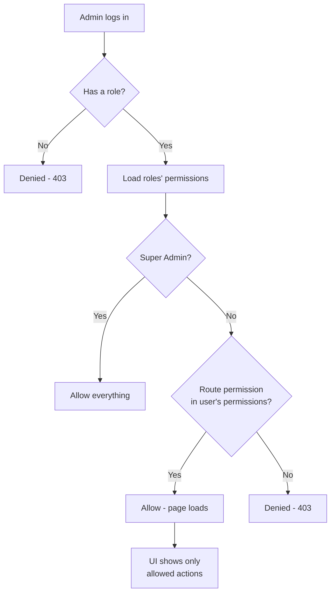

# Feature: Admin Roles & Permissions (RBAC)

Role-Based Access Control for **admin users only** (the `users` table). Customers are not affected.

## Why this exists

The admin dashboard will hold sensitive pages — users, templates, providers, API playground. Not every admin should see or change everything. Roles group permissions, and permissions gate every backend route and admin UI action.

## What was built

### 1. Tables (4 migrations)

| Table | Purpose |
|---|---|
| `roles` | Role name, slug (e.g. `super-admin`, `admin`, `viewer`) + description |
| `permissions` | Permission name + slug (e.g. `users.manage`) |
| `role_user` | Pivot — which roles a user has |
| `permission_role` | Pivot — which permissions a role has |

### 2. Default roles & permissions (seeder)

**Roles:** Super Admin, Admin, Developer, AI Manager, Support, Viewer

**Permissions (15):** `dashboard.view`, `users.view`, `users.manage`, `roles.view`, `roles.manage`, `permissions.view`, `permissions.manage`, `templates.view`, `templates.manage`, `ai.view`, `ai.generate`, `providers.view`, `providers.manage`, `api.playground`, `settings.manage`

### 3. Models & helpers

- `Role` ↔ `Permission` many-to-many; `User` ↔ `Role` many-to-many
- `User::hasPermission('users.manage')` — true if any of the user's roles has it
- `User::isSuperAdmin()` — **Super Admin bypasses every check**

### 4. Permission middleware

`permission:<slug>` route middleware (registered as `permission` in `bootstrap/app.php`). Unauthorized users get **403**, guests are redirected to login.

### 5. React integration

- `permissions` shared to every page via Inertia (in `HandleInertiaRequests`)
- `usePermissions()` hook → `can('users.manage')` for showing/hiding buttons
- Security note: the UI only *hides* things — the backend middleware is the real gate

### 6. Admin pages

- `/admin/users` — list, create (assign roles), edit
- `/admin/roles` — list, create/edit with grouped permission checkboxes; **Super Admin role can't be deleted**
- `/admin/permissions` — read-only list (permissions are managed through roles)

## Flow

## Verification

- `php artisan test --compact --filter=RolePermissionTest` — 9 tests pass:
  - seeder creates 6 roles + 15 permissions
  - roles get permissions, users get roles
  - user without role lacks permission
  - Super Admin bypasses checks
  - 403 without permission, page loads with it
  - guests redirected to login
  - admin can create a user with roles
  - Super Admin role is undeletable

## Notes

- Hand-rolled RBAC (no spatie package) — 4 small tables, full control, no extra dependency
- The old `/users`, `/roles` "Coming Soon" pages now point to these real pages
- Sidebar nav is permission-aware (a viewer doesn't see manage buttons)
