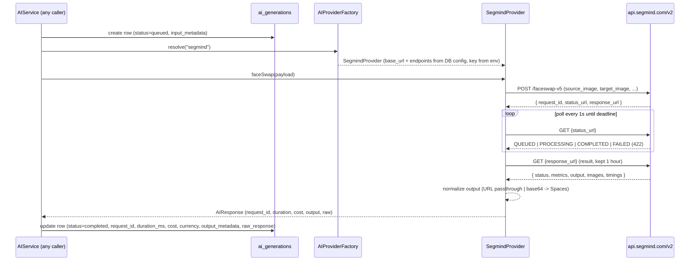

# Feature: AI Provider Architecture (Phase 3 — Segmind face swap)

## What was built

The **core AI abstraction layer**: the app never calls Segmind directly. A clean **AI Service** orchestrates everything — factory → provider → normalized response → persistence — so adding Replicate later is one class + one factory case, zero rewrites elsewhere.

**Scope (per approved plan):** `faceSwap` end-to-end only. `generateImage` and `videoFaceSwap` are declared on the contract but throw `UnsupportedOperationException` (coming in later phases). No API routes, no admin UI in this slice.

## The flow

## Verified Segmind API facts (researched, not guessed)

- **v2 async flow:** `POST /v2/{endpoint}` → `request_id` + `status_url` + `response_url` → poll status until `COMPLETED`/`FAILED` → fetch result (retained 1 hour)
- `FAILED` is served as **HTTP 422** with the error detail still in the body; unknown/expired ids → 404
- Error codes: 400 / 401 / 403 / 404 / **406 (insufficient credits)** / 429 / 500 / 502 / 504
- Result body: `status`, `metrics` (incl. `inference_time`, **`cost`**, `remaining_credits`), `output`, `images`, `timings`
- **Live test result (real key, real call):**
  - Output was a **URL** (`https://images.segmind.com/generations/...jpeg`) — the docs' claim. Base64 still handled defensively (decoded → stored on Spaces → URL returned) in case other models return it
  - **Cost came back in `metrics.cost` (0.05)** — persisted as real cost, never faked
  - Duration 13,962 ms from `metrics.inference_time`

## Key design decisions (per user)

1. `faceSwap` end-to-end; `generateImage` + `videoFaceSwap` are interface stubs
2. **`provider_id` is the source of truth** — no duplicated `provider` string column on `ai_generations`
3. **`cost` = `null` when the provider reports none** — never `0 USD` as "unknown". Segmind reports `metrics.cost` → persisted with currency `USD`
4. **Queue-compatible:** providers are stateless HTTP clients; `AIService::execute()` is one self-contained method — a future queued job (video face swap takes 5+ min) wraps it with no changes here
5. API keys in `.env` (`SEGMIND_API_KEY`), never in the DB. Non-secret settings (base URL, operation→endpoint map) live in `ai_providers.config`
6. Polling: 1s interval, 600s default deadline (configurable per provider instance)
7. One live call ran only after all automated tests passed (user rule)

## Files

- `app/AI/Contracts/AIProviderInterface.php` — the contract (3 operations + `supports()`)
- `app/AI/DTOs/GenerationRequest.php`, `AIResponse.php` — normalized in/out shapes
- `app/AI/Factories/AIProviderFactory.php` — slug → provider (DB-driven)
- `app/AI/Services/AIService.php` — the only class other code calls
- `app/AI/Providers/Segmind/SegmindProvider.php` — v2 submit/poll + output normalization
- `app/AI/Exceptions/` — `UnknownProviderException`, `UnsupportedOperationException`, `AIGenerationFailedException`, `AIGenerationTimeoutException`
- `app/Models/AIProvider.php`, `app/Models/AIGeneration.php` + factories (`ai_providers`, `ai_generations` — note the explicit `$table`; the pluralizer would otherwise guess `a_i_providers`)
- `database/seeders/AIProviderSeeder.php` — seeds `segmind` (base URL + endpoint map)
- `config/ai.php` — provider keys from env, storage disk
- `.env.example` — `SEGMIND_API_KEY` placeholder

## Verification

- ✅ **82 tests pass** (13 new): factory resolution + unknown-provider error, full submit→poll→complete flow (URL output), base64 data-URI → stored on disk, raw base64 → stored, cost persisted / cost-null-when-absent, FAILED (422) → typed exception + failed row, polling timeout, stubs throw, AIService requester/template attachment, failure persistence
- ✅ PHPStan clean · ✅ Pint clean · ✅ `composer run types:check`
- ✅ One live Segmind call (real key): completed, request_id traced, cost 0.05 persisted, output URL confirmed

## Next (Phase 4 — after this is proven)

API routes, admin UI + admin AI page, `api_request_logs` for face swap requests, and capturing **response headers** to extract additional cost/billing data.
