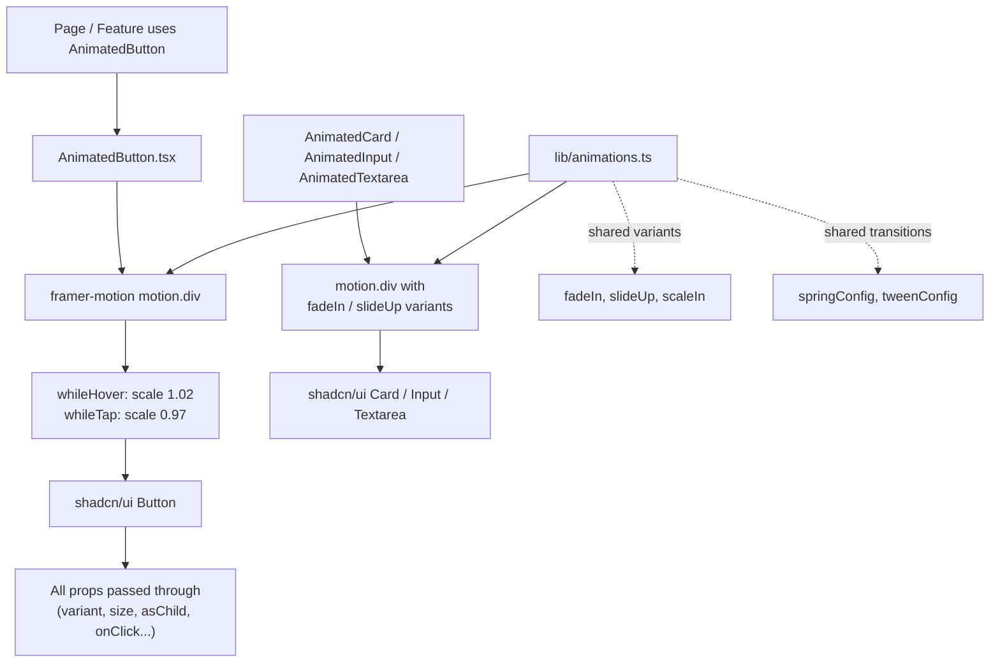

# Animated shadcn/ui wrappers (framer-motion layer)

## What it does

Adds a reusable **animation layer** on top of the existing shadcn/ui components. Instead of styling or duplicating shadcn components, each one gets a small framer-motion wrapper that adds motion around it. Pages use the wrapper (e.g. `AnimatedButton`) and get the same component with smooth animations for free.

The pattern is always the same:

```
Button → AnimatedButton (framer-motion) → shadcn/ui Button
```

The wrapper accepts **exactly the same props** as the original shadcn component, so it is a drop-in replacement — no API break, no restyling.

## Flowchart



## How it works

### The shared animation library — `resources/js/lib/animations.ts`

All motion variants live in one place so every wrapper uses the same "feel":

- `fadeIn` — opacity fade in/out
- `slideUp` — fade in while sliding up (nice for card entrances)
- `scaleIn` — fade in while growing from 95%
- `springConfig` — spring transition (bouncy, used for hover/tap)
- `tweenConfig` — quick 0.2s tween (used for entrances)

### The wrappers — `resources/js/components/animated/`

| Wrapper | Wraps | Animation |
|---|---|---|
| `AnimatedButton.tsx` | `ui/button` | Hover: scale up 1.02 · Tap: scale down 0.97 (spring) |
| `AnimatedCard.tsx` | `ui/card` | Entrance: slide up + fade (tween) |
| `AnimatedInput.tsx` | `ui/input` | Entrance: fade in (tween) |
| `AnimatedTextarea.tsx` | `ui/textarea` | Entrance: fade in (tween) |

Each wrapper takes `ComponentProps<typeof <Original>>` and spreads them onto the shadcn component inside a `motion.div`. Nothing about the shadcn component is changed — the wrapper only adds motion around it.

## How to use it

```tsx
import { AnimatedButton } from '@/components/animated/AnimatedButton';

// Same props as the shadcn Button
<AnimatedButton variant="outline" size="sm" onClick={handleClick}>
    Edit
</AnimatedButton>
```

```tsx
import { AnimatedCard } from '@/components/animated/AnimatedCard';

<AnimatedCard className="max-w-md">
    <CardHeader>
        <CardTitle>Title</CardTitle>
    </CardHeader>
    <CardContent>...</CardContent>
</AnimatedCard>
```

## How to test it

```bash
npm run types:check   # type safety — wrappers must pass props through
npm run build         # production build compiles
```

Visually: render an `AnimatedButton` and click/hover it — it should gently scale. Render an `AnimatedCard` inside a page — it should slide up and fade in on mount.

## Notes

- Animation is kept **light** on purpose (per `project-usecase.md`): hover, tap, and entrance only. No heavy page transitions yet.
- GSAP is reserved for complex animations later; framer-motion covers the current needs.
- More wrappers (Dialog, Sheet, Sidebar) can be added per-feature using the same pattern — this first slice is the four core controls.
