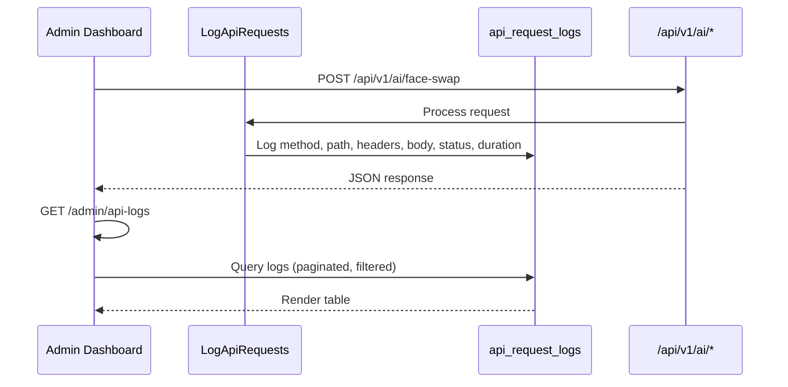

# API Request Logs + Generation Detail

## Overview

Two admin features for inspecting API activity:

1. **API Request Logs** (`/admin/api-logs`) — browse, search, and inspect every logged API request
2. **Generation Detail Modal** — click any generation in the AI page's recent list to see full details including output files

## API Request Logs

### What it shows

Every request to `/api/v1/*` is logged by the `LogApiRequests` middleware. The page displays:

- **Method** (GET/POST/PUT/PATCH/DELETE) — color-coded badges
- **Path** — the API endpoint called
- **Status** — HTTP response code (2xx green, 4xx yellow, 5xx red)
- **Duration** — how long the request took in milliseconds
- **Requester** — admin name or customer name (who made the request)
- **Time** — when the request was made

### Filters

- **Method** — filter by GET, POST, PUT, PATCH, DELETE
- **Status** — filter by exact status code (200, 404, 500, etc.)
- **Path** — search by path segment (e.g. `/api/v1/ai`)

### Expandable rows

Click any row to expand and see:
- Request body (JSON formatted)
- Response body (JSON formatted) — **this is the billing/cost source**
- Request headers (collapsible)
- Response headers (collapsible)

## Generation Detail Modal

On the AI page (`/admin/ai`), the "Recent generations" table is now clickable:

- Click any row → modal opens
- Shows: status badge, operation, template name, cost, duration, request_id
- **Output files**: images render as `` previews, videos as `<video>` players with controls
- Timestamps

## How it works

## Files

| File | Purpose |
|---|---|
| `app/Http/Controllers/Admin/APIRequestLogController.php` | Controller (index + show) |
| `resources/js/pages/admin/api-logs/index.tsx` | Logs page with filters + expandable rows |
| `resources/js/pages/admin/ai/index.tsx` | Added generation detail modal |
| `routes/web.php` | Added `/admin/api-logs` routes |
| `resources/js/components/app-sidebar.tsx` | Added API Logs sidebar link |
| `tests/Feature/AdminAPILogsPageTest.php` | 6 tests |
