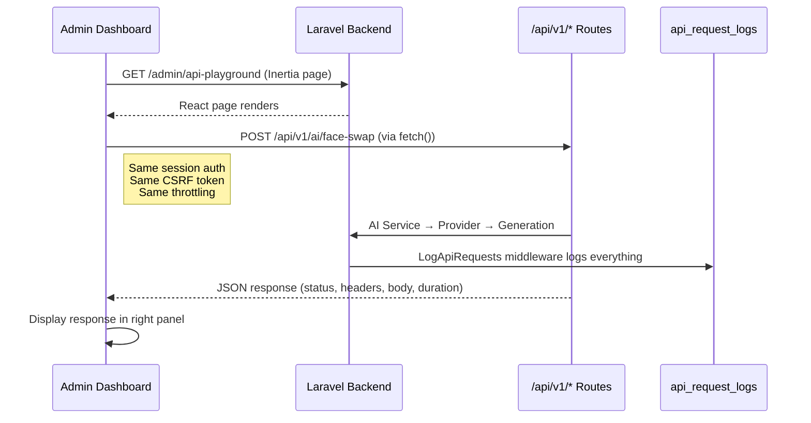

# Admin API Playground

## Overview

The API Playground is a **Postman-like tool** built into the admin dashboard (`/admin/api-playground`) that lets admins test the same API endpoints the mobile app uses — with zero duplicate logic.

## How it works

## Features

- **Method selector**: GET, POST, PUT, PATCH, DELETE
- **URL input**: pre-filled with `/api/v1/...` endpoints
- **Headers editor**: key-value pairs, add/remove rows
- **Body editor**: JSON textarea (shown only for POST/PUT/PATCH)
- **Pre-configured templates**: quick-select chips for Register, Login, /me, Face Swap
- **Response viewer**: status badge (color-coded), duration, collapsible headers, formatted JSON body
- **History**: last 10 requests saved in localStorage, clickable to re-populate
- **Copy button**: copies response body to clipboard

## Why it uses the same endpoints

The playground calls the **same** `/api/v1/*` routes the mobile app uses — session auth for admins, Bearer tokens for customers. This means:

- No duplicate AI logic
- Requests appear in `api_request_logs`
- Same throttling and validation
- Admin can test exactly what the mobile app will experience

## Permission

`api.playground` — already seeded in the role/permission system.

## Files

| File | Purpose |
|---|---|
| `app/Http/Controllers/Admin/APIPlaygroundController.php` | Inertia render (no custom logic) |
| `resources/js/pages/admin/api-playground/index.tsx` | The playground UI |
| `tests/Feature/AdminAPIPlaygroundTest.php` | 4 tests (page load, guest redirect, unauthorized, wrong permission) |
