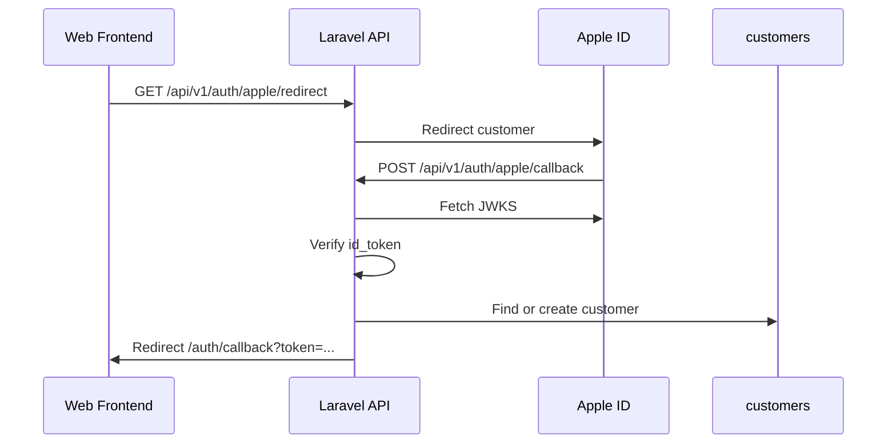
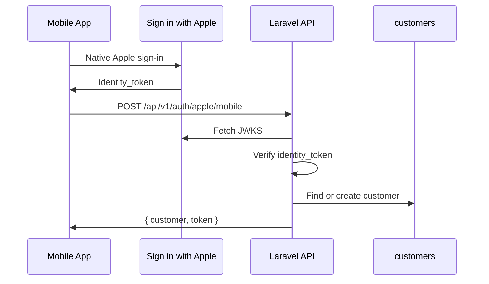

# Feature: Apple Customer Login

Customers can now sign in with Apple. Web users use Apple's browser redirect and form-post callback, while mobile apps can submit the native Apple identity token directly.

## What it does

- Adds Apple login for customer accounts only.
- Keeps admin/Fortify authentication unchanged.
- Creates new Apple customers with the default free plan and 100 coins.
- Links existing customers by Apple provider ID or email when available.
- Supports Apple private-relay emails and repeated Apple logins where email may not be returned again.
- Returns normal Sanctum Bearer tokens, so existing customer API routes keep working.

## Flowchart





## How it works

- `routes/api.php` exposes:
  - `GET /api/v1/auth/apple/redirect`
  - `POST /api/v1/auth/apple/callback`
  - `GET /api/v1/auth/apple/callback` for callback errors
  - `POST /api/v1/auth/apple/mobile`
- `app/Http/Controllers/Api/CustomerSocialAuthController.php` owns the Apple login logic.
- Apple tokens are verified with Apple's JWKS endpoint and `firebase/php-jwt`.
- `APPLE_CLIENT_IDS` accepts comma-separated allowed audiences for mobile bundle IDs and web service IDs.
- Frontend login/register pages send web users to the backend Apple redirect endpoint.
- The existing `frontend/src/pages/auth-callback.tsx` stores the returned token, fetches `/api/v1/auth/me`, and redirects to `/dashboard`.

## How to test it

Backend:

```bash
php artisan test --compact tests/Feature/Auth/CustomerAppleLoginTest.php tests/Feature/Auth/CustomerGoogleLoginTest.php tests/Feature/CustomerAuthTest.php
```

Frontend:

```bash
npm run build
```

Manual web setup:

1. Set `APPLE_CLIENT_ID`, `APPLE_CLIENT_IDS`, `APPLE_REDIRECT_URI`, and `FRONTEND_URL`.
2. In Apple Developer settings, register `APPLE_REDIRECT_URI` as the web return URL.
3. Open the frontend login or register page.
4. Click **Continue with Apple**.
5. Confirm the app returns to `/auth/callback` and then `/dashboard`.

Manual mobile setup:

1. Mobile app signs in with the native Apple SDK.
2. Mobile app sends the identity token to `POST /api/v1/auth/apple/mobile`.
3. Store the returned Sanctum token and use it as `Authorization: Bearer <token>`.
