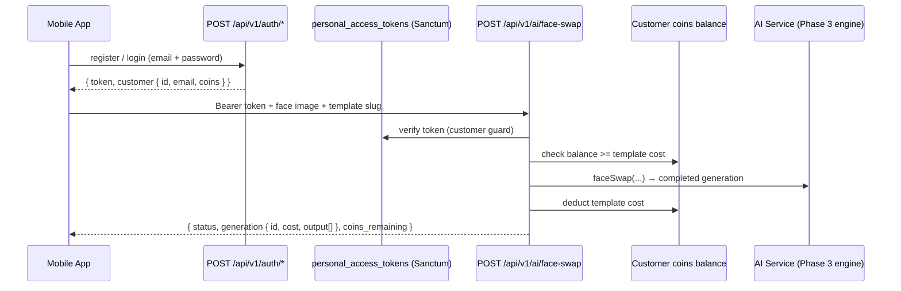

# Feature: Customer Auth (Sanctum) — Phase 5

## What was built

Customers (mobile app + web app end users) can now register, log in, and get **Bearer tokens** via Sanctum. The shared face-swap endpoint now accepts **both** admin session cookies and customer tokens, and each generation **charges coins** from the customer's balance.

## The flow

## Auth endpoints (`/api/v1/auth/*`, JSON, throttled)

| Endpoint | What it does |
|---|---|
| `POST /register` | name + email + password → creates customer (`customer_type: free`, **100 coins**) → returns `token` + customer |
| `POST /login` | email + password → `token` + customer |
| `POST /logout` | revokes the current token (DB verification, not client-side only) |
| `GET /me` | authenticated customer profile (requires Bearer token) |

- Validation errors → 422 JSON. Wrong credentials → 401 JSON. All auth routes throttled (`throttle:6,1` on register/login).
- No email verification or password reset yet (planned later).

## Coin system (customer economy)

- **New customers start with 100 coins** (`customers.coins` default — added in place to the original migration, no new migration).
- Each generation charges **the template's cost** (`templates.cost`; Segmind's real `metrics.cost` is logged separately in `ai_generations.cost` — the coin charge is the platform's own pricing).
- **Insufficient balance → 402 JSON** (`"Not enough coins"`); no provider call is made.
- Deduction happens **only on a completed generation** (the DB row is charged, not on submit — no charge for failures).

## Same endpoint, both auth types

`POST /api/v1/ai/face-swap` now sits behind `auth:sanctum` with the `customer` guard added:

- **Admin dashboard** → session cookie (Fortify) → requester recorded as `user_id` — works exactly as before
- **Mobile app** → Bearer token → requester recorded as `customer_id`

The admin page keeps working unchanged — no duplicate AI logic (the architecture rule).

## Infrastructure

- **Sanctum installed** (pinned version in `composer.json`) + `config/sanctum.php` + `personal_access_tokens` migration
- **New `customer` guard** in `config/auth.php` (provider `customers`, password broker `customers`) — admin Fortify auth untouched
- `Customer` model: `HasApiTokens` trait + `tokenName` helper
- `api_request_logs` records **either** `user_id` (admin) **or** `customer_id` (customer) — `AIService` and the logger read the authenticated requester from the request

## Files

- `routes/api.php` — auth group + face-swap moved to `auth:sanctum`
- `app/Http/Controllers/Api/CustomerAuthController.php` + `RegisterRequest` + `LoginRequest`
- `app/Http/Controllers/Api/AIFaceSwapController.php` — coin check/deduct + customer_id requester
- `app/AI/Services/AIService.php` — `user_id` or `customer_id` persistence
- `app/Http/Middleware/LogApiRequests.php` — customer_id capture
- `app/Models/Customer.php`, `config/auth.php`, `composer.json`

## Verification

- ✅ **102 tests pass** (10 new): register (token + 100 coins), duplicate email 422, login (wrong password 401, success), logout (token revoked in DB), `me` (valid + 401 without token), coin deduction on success, 402 on insufficient balance, admin session flow still intact
- ✅ PHPStan · ✅ Pint · ✅ `npm run build`

## Next

Social login (Google/Apple — needs your client credentials) · email verification / password reset · admin template forms get a **Cost** input (coin pricing UI) · then video face swap (queued job, 5+ min) and the API playground.
