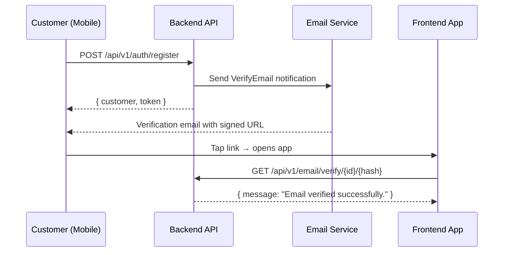
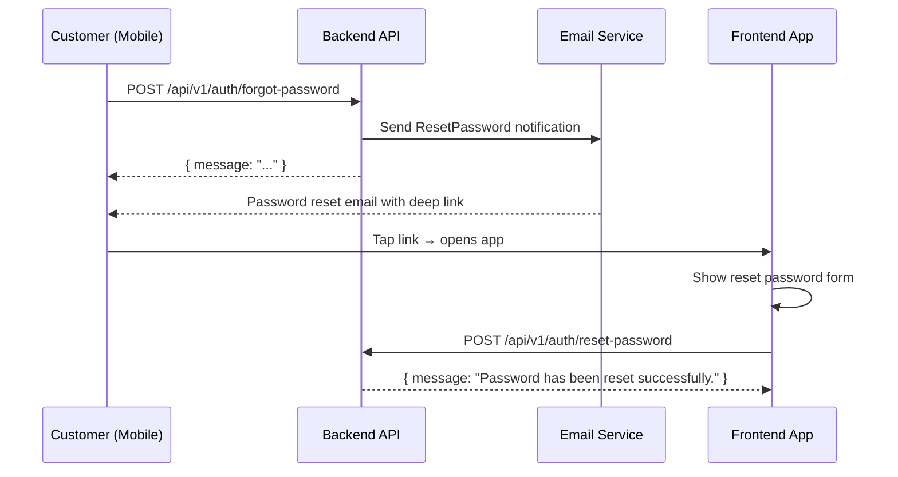

# Feature: Customer Email Verification + Password Reset

## What was built

Customers can now verify their email address and reset their password via API endpoints. Both flows send emails with deep links that the mobile/frontend app can intercept.

## Email verification flow

## Password reset flow

## API endpoints

| Endpoint | Auth | Purpose |
|---|---|---|
| `POST /api/v1/auth/email/verify/resend` | sanctum | Resend verification email (unverified only) |
| `GET /api/v1/email/verify/{id}/{hash}` | signed URL | Verify email via signed URL |
| `POST /api/v1/auth/forgot-password` | guest | Send password reset email |
| `POST /api/v1/auth/reset-password` | guest | Reset password with token |

## Implementation details

- **Customer model** gains `MustVerifyEmail` interface + `CanResetPassword` trait
- **VerifyEmail notification** uses `URL::temporarySignedRoute()` with 60-minute expiry
- **CustomerResetPassword notification** includes token + email in frontend deep link URL
- **`customers` password broker** added to `config/auth.php` (shares `password_reset_tokens` table with `users`)
- **`FRONTEND_URL`** env var controls deep link base URL (defaults to `http://localhost:5173`)
- **Throttling**: forgot-password throttled to 5 requests/minute, registration/login to 10/minute
- **Email enumeration prevention**: forgot-password always returns success regardless of email existence

## Files

- `app/Models/Customer.php` — `MustVerifyEmail`, `CanResetPassword`
- `app/Notifications/VerifyEmail.php` — signed URL email
- `app/Notifications/CustomerResetPassword.php` — reset token email
- `app/Http/Controllers/Api/CustomerAuthController.php` — `sendVerificationEmail`, `verifyEmail`, `forgotPassword`, `resetPassword`
- `app/Http/Requests/Api/SendVerificationEmailRequest.php`
- `app/Http/Requests/Api/ForgotPasswordRequest.php`
- `app/Http/Requests/Api/ResetPasswordRequest.php`
- `routes/api.php` — 4 new routes
- `config/auth.php` — `customers` password broker
- `config/app.php` — `frontend_url`
- `tests/Feature/Auth/CustomerEmailVerificationTest.php` — 7 tests
- `tests/Feature/Auth/CustomerPasswordResetTest.php` — 9 tests

## Verification

- ✅ **16 new tests pass**: email verification (send, verify, expired URL, wrong hash, already verified, registration sends email) + password reset (forgot, non-existing email, reset, invalid token, validation, login after reset)
- ✅ All 61 existing auth tests still pass
