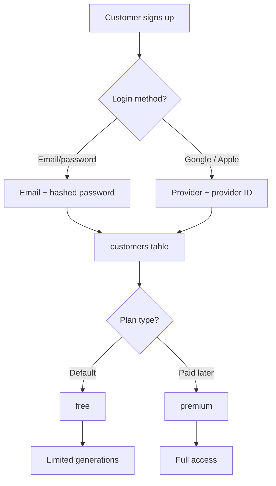

# Feature: Customer Foundation

Customers are the **end users** of the mobile app and web app — the people who upload their face and generate images / face swaps. They are completely separate from the admin `users` table.

## Why this exists

The project has two very different kinds of accounts:

| | Admin (`users`) | Customer (`customers`) |
|---|---|---|
| Who | Staff managing the platform | End users generating images |
| Login | Email/password + passkeys + 2FA | Email/password, Google, Apple |
| Extra | Roles & permissions | Free / Premium plan |
| Payments | — | Subscriptions (later) |

Keeping them separate means each table stays simple, and their auth rules never conflict.

## What was built

### 1. `customers` table (migration)

| Column | Purpose |
|---|---|
| `email` | Unique login identifier |
| `password` | Hashed (nullable — social logins have none) |
| `auth_provider` | `email` / `google` / `apple` (tiktok, facebook in v2) |
| `auth_provider_id` | The user's ID at the provider |
| `customer_type` | `free` (default) or `premium` |
| `avatar` | Profile picture |
| `last_active_at` | When they last used the app |
| `email_verified_at` | Standard Laravel verification |

### 2. `Customer` model (`app/Models/Customer.php`)

- Constants `TYPE_FREE`, `TYPE_PREMIUM`
- Helpers: `isFree()`, `isPremium()`
- `password` is hidden from JSON
- `customer_type` casts to string automatically

### 3. `CustomerFactory` (`database/factories/CustomerFactory.php`)

- `premium()` state — creates a premium customer
- `social('google')` state — no password, provider stored
- Default: free customer with hashed password

## Flow

## Verification

- `php artisan test --compact --filter=CustomerTest` — 6 tests pass:
  - factory creates a valid free customer
  - defaults to free plan
  - premium state applies
  - social login has no password + stores provider
  - emails are unique
  - password is hashed

## Not in this slice (planned later)

- Customer authentication routes / Sanctum API tokens
- Social login callbacks (Google, Apple)
- Free-quota limits on the AI endpoints
- Subscriptions & payments (Stripe, RevenueCat, KBZ, Google/Apple Pay)
- Customer admin management pages
