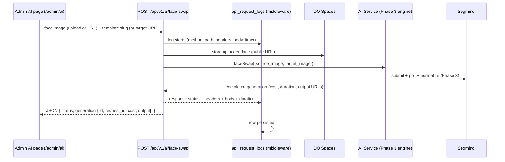

# Feature: Face Swap API + Request Logging + Admin AI Page (Phase 4)

## What was built

The Phase 3 engine is now exposed through a **single shared JSON API endpoint** — the same one the mobile app will use later — plus **full request logging** (including response headers for billing) and an **admin AI page** that calls that same endpoint (no duplicate AI logic anywhere, per the architecture rule).

## The flow

## API endpoint

`POST /api/v1/ai/face-swap` (auth: admin session for now; Sanctum/customer tokens come with customer auth — endpoint unchanged)

| Field | Required | Notes |
|---|---|---|
| `face_image` | exactly one of pair | file upload, image, ≤10 MB — stored on Spaces, public URL used |
| `face_image_url` | exactly one of pair | public URL |
| `template_slug` | exactly one of pair | active template only; looked up **by slug** |
| `target_image_url` | exactly one of pair | public URL |

Response: `{ status, generation: { id, request_id, operation, status, cost, currency, duration_ms, output[] } }` — no API keys, no provider internals. 422 on invalid input, 404 on unknown template, 401 unauthenticated, `throttle:30,1` rate limit.

## Request logging

`LogApiRequests` middleware (registered on the `api` group — every `/api/*` route logs automatically):

- Stores: method, path, **request headers (sensitive `Authorization`/`Cookie`/`x-api-key` excluded)**, request body (uploaded files become name/size metadata), response status, **response headers in full (billing/cost source)**, response body, duration_ms
- Logs successes **and** failures (validation 422s included)

## Admin AI page (`/admin/ai`)

- **Face Swap tool**: upload a face (with preview) or paste a face URL; pick a template (with thumbnails) or paste a target URL → **Generate** → the page `fetch`es the same `/api/v1/ai/face-swap` endpoint with the session CSRF token → result image(s) + status/cost/duration/request_id badges
- **Recent generations** table (last 20): status badge, operation, template, cost, duration, created_at
- Permission-gated: `ai.view` to view the page, `ai.generate` to run swaps (sidebar "AI Generation" now points here)

## Key design decisions

1. **One shared endpoint** — admin page and future mobile app hit `/api/v1/ai/face-swap`; no admin-specific AI logic
2. **Session auth for now** — the admin dashboard is the only consumer; Sanctum ships with customer auth (endpoints unchanged)
3. **Synchronous execution** — face swap (~10–30s) completes in the request; queued jobs for video come in Phase 5/8
4. **Response headers logged in full** — user-requested (billing/cost source); request headers sanitized
5. **Face uploads** stored on the `spaces` disk as public URLs (Segmind requires public URLs for inputs)

## Files

- `routes/api.php` (new) + `bootstrap/app.php` (api routing + `LogApiRequests` on the api group)
- `app/Http/Controllers/Api/AIFaceSwapController.php` + `app/Http/Requests/Api/FaceSwapRequest.php` (exactly-one-of-pair validation)
- `app/Http/Middleware/LogApiRequests.php` + `app/Models/ApiRequestLog.php` + migration
- `app/Http/Controllers/Admin/AIController.php` + `resources/js/pages/admin/ai/index.tsx`
- `resources/js/components/app-sidebar.tsx` (AI Generation → `/admin/ai`)

## Verification

- ✅ **92 tests pass** (10 new): uploaded-face + template flow, URLs-only flow, exactly-one validation (3 cases), unknown template 404, guest 401, request logging (headers/body/duration/user, sensitive headers excluded, failures logged), admin page (permission, templates + generations listed)
- ✅ PHPStan · ✅ Pint · ✅ ESLint · ✅ Prettier · ✅ TypeScript · ✅ `npm run build`

## Next

Customer auth (Sanctum) so mobile can call the same endpoint · video face swap (queued job, 5+ min) · admin API playground with request history · free-user quota enforcement.
