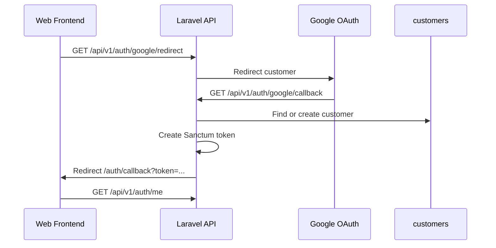
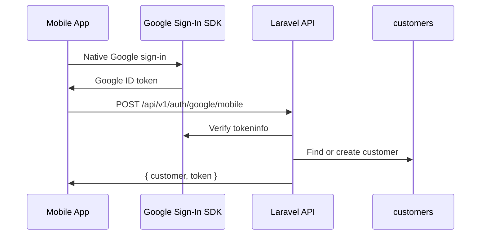

# Feature: Google Customer Login

Customers can now sign in with Google. Web users use a browser redirect flow, and mobile apps can send a native Google ID token directly to the API.

## What it does

- Adds Google login for customer accounts only.
- Keeps admin/Fortify authentication unchanged.
- Creates new Google customers with the default free plan and 100 coins.
- Links an existing customer by email when they sign in with Google.
- Marks Google customers as email verified because Google already verifies the email.
- Returns normal Sanctum Bearer tokens, so all existing customer API routes keep working.

## Flowchart





## How it works

- `routes/api.php` exposes:
  - `GET /api/v1/auth/google/redirect`
  - `GET /api/v1/auth/google/callback`
  - `POST /api/v1/auth/google/mobile`
- `app/Http/Controllers/Api/CustomerSocialAuthController.php` owns the Google login logic.
- Web OAuth uses Laravel Socialite with `stateless()`.
- Mobile login verifies the native Google ID token with Google's `tokeninfo` endpoint.
- `config/services.php` reads `FRONTEND_URL`, `GOOGLE_CLIENT_ID`, `GOOGLE_CLIENT_SECRET`, and `GOOGLE_REDIRECT_URI`.
- Frontend login/register pages send web users to the backend Google redirect endpoint.
- `frontend/src/pages/auth-callback.tsx` stores the returned token, fetches `/api/v1/auth/me`, and redirects to `/dashboard`.

## How to test it

Backend:

```bash
php artisan test --compact tests/Feature/Auth/CustomerGoogleLoginTest.php tests/Feature/CustomerAuthTest.php
```

Frontend:

```bash
npm run build
```

Manual web setup:

1. Set `GOOGLE_CLIENT_ID`, `GOOGLE_CLIENT_SECRET`, `GOOGLE_REDIRECT_URI`, and `FRONTEND_URL`.
2. In Google Cloud Console, register `GOOGLE_REDIRECT_URI` as the OAuth redirect URI.
3. Open the frontend login or register page.
4. Click **Continue with Google**.
5. Confirm the app returns to `/auth/callback` and then `/dashboard`.

Manual mobile setup:

1. Mobile app signs in with Google's native SDK.
2. Mobile app sends the Google ID token to `POST /api/v1/auth/google/mobile`.
3. Store the returned Sanctum token and use it as `Authorization: Bearer <token>`.
