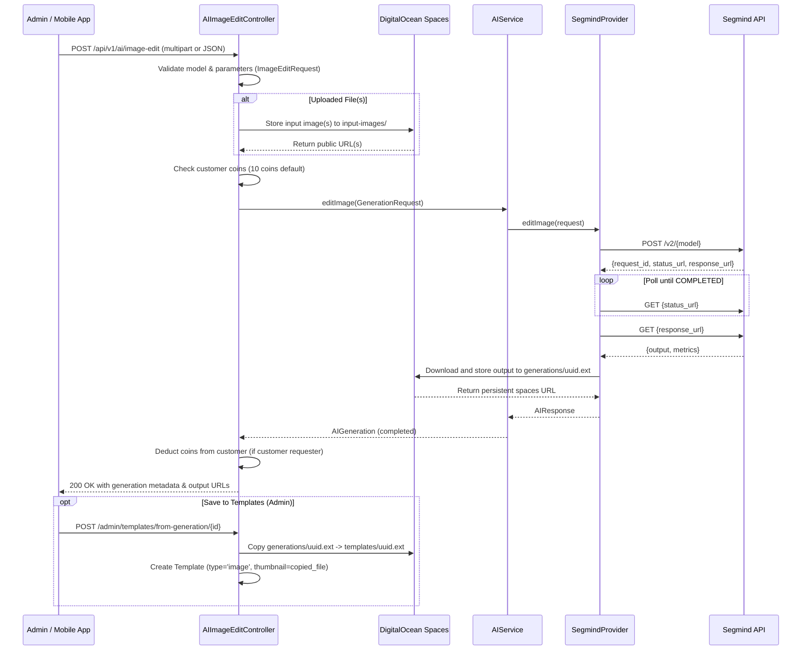

# Image Editing

## What it does

Enables AI-powered image editing from text prompts and reference images using 6 Segmind models:
1. **Multi-Image Kontext Max (`multi-image-kontext-max`)**: Blends two images (e.g. base model person + garment/style image) preserving poses and composition.
2. **Flux Kontext Dev (`flux-kontext-dev`)**: Edits a single reference image (e.g. background replacement, subject restyling) maintaining identity and structure.
3. **Seedream v5 Lite Image-to-Image (`seedream-v5-lite-image-to-image`)**: Image-to-image styling and editorial generation with configurable image input array and resolution up to 3K.
4. **GPT Image 1.5 Edit (`gpt-image-1.5-edit`)**: Image editing and enhancement with quality, background, compression, and moderation options.
5. **Kling 3 Image2Image (`kling-3-image2image`)**: Cinematic image-to-image transformation with 1K resolution and aspect ratio control.
6. **Nano Banana Pro (`nano-banana-pro`)**: Multimodal image editing with high-res 4K output, system prompt instruction, and text/image response.

Includes an **"Image Editing"** tab on the Admin AI page (`/admin/ai`) with model switching, real-time image previews (upload or URL), result preview, and **"Save to Templates"** functionality to promote edited outputs into Image Templates.

---

## Architecture Flow



---

## API Endpoint

**`POST /api/v1/ai/image-edit`**

### Headers
- `Authorization: Bearer <token>` (or web session cookie with `X-XSRF-TOKEN`)
- `Accept: application/json`

### Supported Models & Parameters

#### 1. `multi-image-kontext-max`
| Field | Type | Required | Description |
|---|---|---|---|
| `model` | string | ✅ | Must be `"multi-image-kontext-max"` |
| `prompt` | string | ✅ | Text instruction (e.g. "put the green dress on the woman...") |
| `input_image_1` / `input_image_1_url` | file / url | ✅ | First reference image |
| `input_image_2` / `input_image_2_url` | file / url | ✅ | Second reference image |
| `aspect_ratio` | string | ❌ | `"1:1"` (default), `"16:9"`, `"9:16"`, `"4:3"`, `"3:4"`, `"match_input_image"` |
| `output_format` | string | ❌ | `"jpg"` (default), `"png"`, `"webp"` |
| `safety_tolerance` | int | ❌ | `1` (default, strict) to `6` (permissive) |
| `seed` | int | ❌ | Optional seed for reproducibility |

#### 2. `flux-kontext-dev`
| Field | Type | Required | Description |
|---|---|---|---|
| `model` | string | ✅ | Must be `"flux-kontext-dev"` |
| `prompt` | string | ✅ | Text instruction (e.g. "Replace background with a bokeh light effect...") |
| `input_image` / `input_image_url` | file / url | ✅ | Source image to edit |
| `aspect_ratio` | string | ❌ | `"match_input_image"` (default), `"1:1"`, `"16:9"`, `"9:16"`, `"4:3"`, `"3:4"` |
| `guidance` | float | ❌ | Guidance scale (default: `7`) |
| `num_inference_steps` | int | ❌ | Denoising steps (1 to 50, default: `35`) |
| `output_format` | string | ❌ | `"png"` (default), `"jpg"`, `"webp"` |
| `output_quality` | int | ❌ | Quality level (1 to 100, default: `90`) |
| `disable_safety_checker` | bool | ❌ | Toggle safety checker (default: `false`) |
| `seed` | int | ❌ | Optional seed for reproducibility |

#### 3. `seedream-v5-lite-image-to-image`
| Field | Type | Required | Description |
|---|---|---|---|
| `model` | string | ✅ | Must be `"seedream-v5-lite-image-to-image"` |
| `prompt` | string | ✅ | Text prompt describing transformation |
| `image_input` / `input_image_url` | array / url | ✅ | Reference image(s) |
| `aspect_ratio` | string | ❌ | `"16:9"` (default), `"1:1"`, `"9:16"`, `"4:3"`, `"3:4"` |
| `size` | string | ❌ | `"3K"` (default), `"2K"`, `"1K"`, `"auto"` |
| `max_images` | int | ❌ | Number of output images (default: `1`) |
| `optimize_prompt` | string | ❌ | `"fast"` (default), `"standard"` |
| `watermark` | bool | ❌ | Add watermark (default: `false`) |

#### 4. `gpt-image-1.5-edit`
| Field | Type | Required | Description |
|---|---|---|---|
| `model` | string | ✅ | Must be `"gpt-image-1.5-edit"` |
| `prompt` | string | ✅ | Text instruction |
| `image_urls` / `input_image_url` | array / url | ✅ | Image reference(s) |
| `size` | string | ❌ | `"auto"` (default), `"1024x1024"` |
| `quality` | string | ❌ | `"high"` (default), `"standard"` |
| `background` | string | ❌ | `"opaque"` (default), `"transparent"` |
| `output_compression` | int | ❌ | Compression percentage 1-100 (default: `100`) |
| `output_format` | string | ❌ | `"png"` (default), `"jpg"`, `"webp"` |
| `moderation` | string | ❌ | Moderation level (default: `"auto"`) |

#### 5. `kling-3-image2image`
| Field | Type | Required | Description |
|---|---|---|---|
| `model` | string | ✅ | Must be `"kling-3-image2image"` |
| `prompt` | string | ✅ | Image prompt |
| `image_url` / `input_image_url` | url / file | ✅ | Source image URL |
| `resolution` | string | ❌ | `"1K"` (default), `"720p"` |
| `aspect_ratio` | string | ❌ | `"16:9"` (default), `"1:1"`, `"9:16"` |
| `output_format` | string | ❌ | `"png"` (default), `"jpg"` |

#### 6. `nano-banana-pro`
| Field | Type | Required | Description |
|---|---|---|---|
| `model` | string | ✅ | Must be `"nano-banana-pro"` |
| `prompt` | string | ✅ | Image instruction |
| `image_urls` / `input_image_url` | array / url | ✅ | Source image URLs |
| `system_prompt` | string | ❌ | Optional system prompt for model guidance |
| `aspect_ratio` | string | ❌ | `"1:1"` (default), `"16:9"`, `"9:16"` |
| `output_resolution` | string | ❌ | `"4K"` (default), `"2K"`, `"1K"` |
| `output_format` | string | ❌ | `"jpg"` (default), `"png"`, `"webp"` |
| `response_modalities` | string | ❌ | `"TEXT_AND_IMAGE"` (default) |

### Success Response (200 OK)
```json
{
  "status": "completed",
  "generation": {
    "id": 42,
    "request_id": "segmind-req-uuid",
    "operation": "image-editing",
    "status": "completed",
    "cost": "0.0400",
    "currency": "USD",
    "duration_ms": 12500,
    "output": [
      "https://imagesbucket.sgp1.digitaloceanspaces.com/generations/uuid.png"
    ],
    "coins_spent": 10,
    "coins_remaining": 90
  }
}
```

---

## Admin Dashboard (`/admin/ai`)

- **Tab**: "Image Editing" added alongside Image Face Swap, Video Face Swap, Image Generation, and Image to Video.
- **Model selector**: Switch between `multi-image-kontext-max`, `flux-kontext-dev`, `seedream-v5-lite-image-to-image`, `gpt-image-1.5-edit`, `kling-3-image2image`, and `nano-banana-pro`.
- **Upload / URL Toggle**: Upload files directly from local disk or provide image URLs.
- **Result card**:
  - In-place render without page refresh.
  - Live loading indicator during generation.
  - Rendered output preview.
  - Metrics badges: status, cost in USD, compute duration, request ID.
  - **"Save to Templates"**: Copies output file to `templates/` and creates a new Image Template automatically.
  - **"Delete"**: Removes generation record and stored cloud output.

---

## API Playground (`/admin/api-playground`)

Added pre-configured templates under the AI group for all supported models:
1. `Image Edit - Flux (URL)`
2. `Image Edit - Multi-Image (URL)`
3. `Image Edit - Seedream (URL)`
4. `Image Edit - GPT Image (URL)`
5. `Image Edit - Kling 3 (URL)`
6. `Image Edit - Nano Banana (URL)`
7. `Image Edit (Upload)` (supports multipart file uploads)
