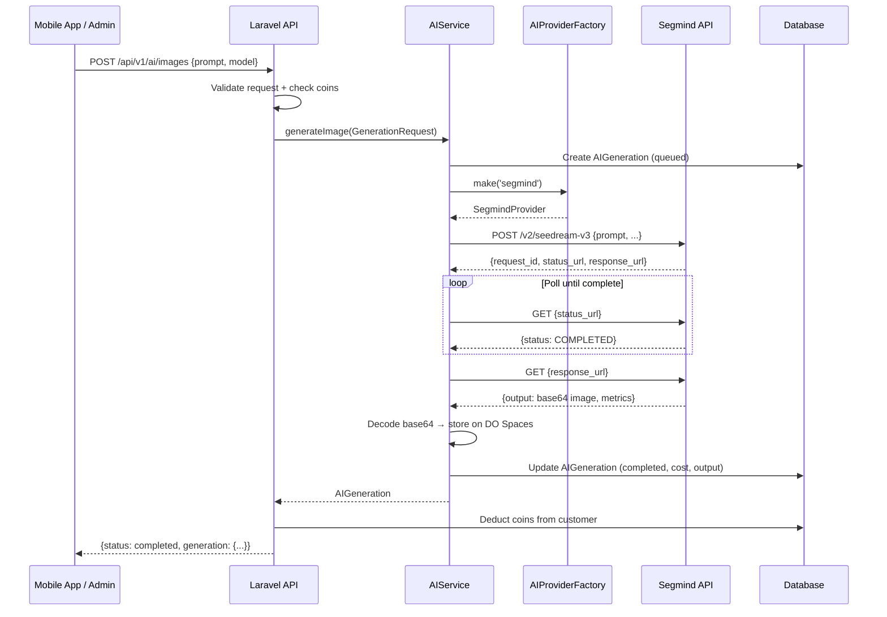

# Image Generation (Text → Image)

## What it does

Generate images from text prompts using Segmind AI models. Customers spend coins per generation; the admin can test from the AI dashboard or the API Playground.

## Flow



## API Endpoint

**`POST /api/v1/ai/images`**

### Request

| Field | Type | Required | Default | Description |
|---|---|---|---|---|
| `prompt` | string | ✅ | — | Text description of the image to generate |
| `negative_prompt` | string | ❌ | null | What to avoid in the image |
| `model` | string | ❌ | `seedream-v3` | Segmind model to use |
| `width` | int | ❌ | 1024 | Image width (512/768/1024/1536/2048) |
| `height` | int | ❌ | 1024 | Image height (512/768/1024/1536/2048) |
| `seed` | int | ❌ | null | Random seed for reproducibility |
| `image_format` | string | ❌ | png | Output format (png/jpg/webp) |
| `quality` | int | ❌ | 95 | Image quality (80/85/90/95) |

### Response (200)

```json
{
    "status": "completed",
    "generation": {
        "id": 1,
        "request_id": "req_abc123",
        "operation": "image-generation",
        "status": "completed",
        "cost": "0.0200",
        "currency": "USD",
        "duration_ms": 1500,
        "output": ["https://...generated-image.png"],
        "coins_spent": 5,
        "coins_remaining": 95
    }
}
```

### Supported Models

| Model | Best for |
|---|---|
| `seedream-v5-lite-text-to-image` | Fast, affordable, instruction-following (default) |
| `nano-banana-2-lite` | Google's fastest (~4 seconds) |
| `qwen-image-3` | Qwen Image 3, generates/edits with legible in-image text |

## Admin Dashboard

- **AI Generation page** → new "Image Generation" tab
- Prompt textarea + negative prompt + model/size selectors
- Generate button → shows result image

## API Playground

- New "Image Generation" template with pre-filled prompt

## Coin Cost

- 5 coins per generation (default)
- Deducted after successful generation
- Returns 402 if insufficient coins

## Files

| File | Purpose |
|---|---|
| `app/Http/Controllers/Api/AIImageGenerationController.php` | API endpoint |
| `app/Http/Requests/Api/ImageGenerationRequest.php` | Validation |
| `app/AI/Providers/Segmind/SegmindProvider.php` | `generateImage()` method |
| `app/AI/Services/AIService.php` | `generateImage()` convenience method |
| `routes/api.php` | Route definition |
| `database/seeders/AIProviderSeeder.php` | Added `image-generation` operation |
| `resources/js/pages/admin/ai/index.tsx` | Image Generation tab |
| `resources/js/pages/admin/api-playground/index.tsx` | Playground template |
| `tests/Feature/ImageGenerationApiTest.php` | 6 tests |
