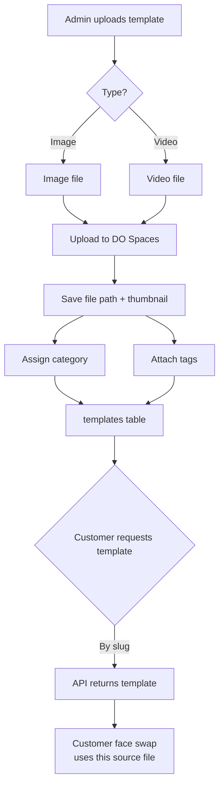

# Feature: Templates CRUD (Admin)

Templates are the **face-swap source files** — e.g. a Superman photo or video. A customer uploads their face, picks a template, and Segmind swaps their face onto it.

## Why this exists

Face swap needs a library of ready-made images/videos. Admins manage that library: upload files (image **or** video), organize them into categories (Superhero, Football, Anime), and tag them for global search.

## What was built

### 1. Tables (4 migrations)

| Table | Purpose |
|---|---|
| `template_categories` | Groups — Superhero, Football, Anime... (name, slug, active) |
| `templates` | The source files (name, **slug**, type image/video, file + thumbnail paths, Segmind model, active) |
| `template_tags` | Search keywords (name, slug) |
| `template_tag` | Pivot — which tags a template has |

### 2. Models

- `Template`, `TemplateCategory`, `TemplateTag`
- Slugs auto-generated from names (`Str::slug`) and **stable once created** — the customer API looks templates up by slug, so renaming never breaks existing links
- Pivot declared explicitly (`template_tag`) to match the migration

### 3. Controllers (3)

- **TemplateController** — list (category filter + name/slug/tag search), create, edit, delete
- **TemplateCategoryController** — full CRUD with `templates_count`
- **TemplateTagController** — full CRUD with `templates_count`

### 4. Storage — DigitalOcean Spaces

- Files upload to `Storage::disk('spaces')` (S3-compatible, tested live earlier)
- Paths: `templates/` for the source file, `templates/thumbnails/` for the preview image
- Deleting a template **also deletes its files from Spaces**
- Validation: file max 50 MB, thumbnail max 5 MB (image only)

### 5. Admin pages (all animated with `AnimatedCard` / `AnimatedButton`)

- `/admin/templates` — card grid with thumbnails, type badge, category, tags, active state; search + category filter
- `/admin/templates/create` & `/edit` — upload form (file type switches accept between image/video), category select, tag checkboxes, active switch
- `/admin/template-categories` — table CRUD
- `/admin/template-tags` — table CRUD

All routes are permission-gated (`templates.view` / `templates.manage`).

## Flow

## Verification

- `php artisan test --compact --filter=TemplateCrudTest` — 7 tests pass:
  - category full CRUD (create → edit → delete)
  - tag create + rename (slug stays stable)
  - image template upload with category + tags → files exist on the `spaces` disk
  - template update can replace the file
  - delete removes the file from storage
  - listing filters by category and search
  - routes require the `templates` permission (403 without it)

## Notes

- Template uploads go straight to your real DO Spaces bucket in dev (the disk is `spaces`)
- In tests, storage is faked — no real files are written
- Tags are the search foundation for the customer-facing global search later
