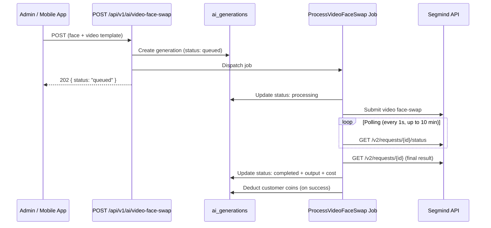

# Video Face Swap

## Overview

Video face swap swaps a face from an image onto a target video. Unlike image face-swap (10-30s), video generation takes **5+ minutes**, so it runs as a **queued job** — the API returns immediately with `queued` status, and the admin page polls for completion.

## How it works

## API Endpoints

| Method | Endpoint | Auth | Purpose |
|---|---|---|---|
| POST | `/api/v1/ai/video-face-swap` | sanctum | Submit video face-swap (returns 202 queued) |
| GET | `/api/v1/ai/generations/{id}` | sanctum | Poll generation status |

## Admin UI

`/admin/ai` → **Video Face Swap** tab:
- Face upload + video template picker (only `type = 'video'` templates)
- Generate button → calls API → polling every 5s
- Result video player + cost/duration/request_id badges

## Key differences from image face-swap

| | Image Face-Swap | Video Face-Swap |
|---|---|---|
| Time | 10-30 seconds | 5+ minutes |
| Execution | Synchronous | Queued job |
| API response | 200 (result) | 202 (queued) |
| Cost check | Before call | Before dispatch |
| Coin deduction | After completion | In job on success |

## Files

| File | Purpose |
|---|---|
| `app/AI/Providers/Segmind/SegmindProvider.php` | `videoFaceSwap()` — submit + poll (10 min timeout) |
| `app/Jobs/ProcessVideoFaceSwap.php` | Queued job wrapping `AIService::execute()` |
| `app/Http/Controllers/Api/AIVideoFaceSwapController.php` | API endpoint (creates generation + dispatches job) |
| `app/Http/Controllers/Api/AIGenerationStatusController.php` | Poll endpoint for generation status |
| `app/Http/Requests/Api/VideoFaceSwapRequest.php` | Validation rules |
| `resources/js/pages/admin/ai/index.tsx` | Admin UI with image/video tabs |
| `database/seeders/AIProviderSeeder.php` | Added `video-face-swap` endpoint |
| `tests/Feature/VideoFaceSwapApiTest.php` | 7 tests |
